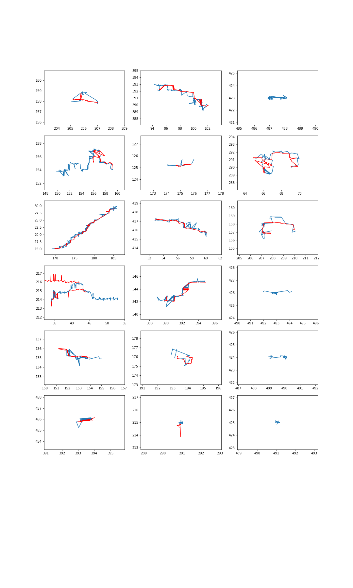

# Trajectory analysis

The experimental data is a set of videos with different experimental
conditions. C=0 is the green channel, imaging HK. C=1 is the red channel,
imaging Aldolase.

For each video, we identify the Hexokinase trajectories. Then, for each
hexokinase trajectory, we plot all nearby Aldolase trajectory and plot the
result.

To do: calculate a significance test that shows the trajectories are related
(although it is obvious from visual inspection).

## Recap of the algorithmic procedure

The steps are shown in [this notebook](../rev_notebooks/particle_expl.ipynb).

- locate step: the image goes through a band pass filter, a threshold filter,
  then the peaks are located and fit to a gaussian (using trackpy)
- trajectory step: the features are then linked from frame to frame into
  trajectories.

The parameters of the above are manually tuned to produce meanigful looking
trajectories, then are fixed for all videos, except the 20X video.

